# SNF data description
  * The SNF datasets were part of the datasets used in the Nature Methods paper on Similarity Network Fusion (SNF); https://www.nature.com/articles/nmeth.2810
  * The cancer datasets include GBM (Brain), Colon, Kidney, Lung and Breast (the Breast cancer dataset was excluded in order to avoid confusion with the case study on Breast Cancer)
  * The datasets were obtained from: http://compbio.cs.toronto.edu/SNF/SNF/Software.html
  * Survival times were provided for each disease cohort. The median survival time was used to dictomize each response variables into low and high survival times.

## number of samples in each group


```
##      colon kidney gbm lung Sum
## high    33     61 105   53 252
## low     59     61 108   53 281
## Sum     92    122 213  106 533
```

## number of variables in each dataset
* mRNA transcripts or cpg probes that mapped to the same gene were averaged 


```
##       colon kidney   gbm  lung
## mrna  17814  17665 12042 12042
## mirna   312    329   534   352
## cpg   23088  24960  1305 23074
```

# Multi-omic biomarker panels

## Unsupervised

### JIVE


### MOFA


### sGCCA


## Supervised

### Concatenation_sPLSDA


### Ensemble_spslda


### DIABLO_null


### DIABLO_full


\pagebreak

# Number of features per panel

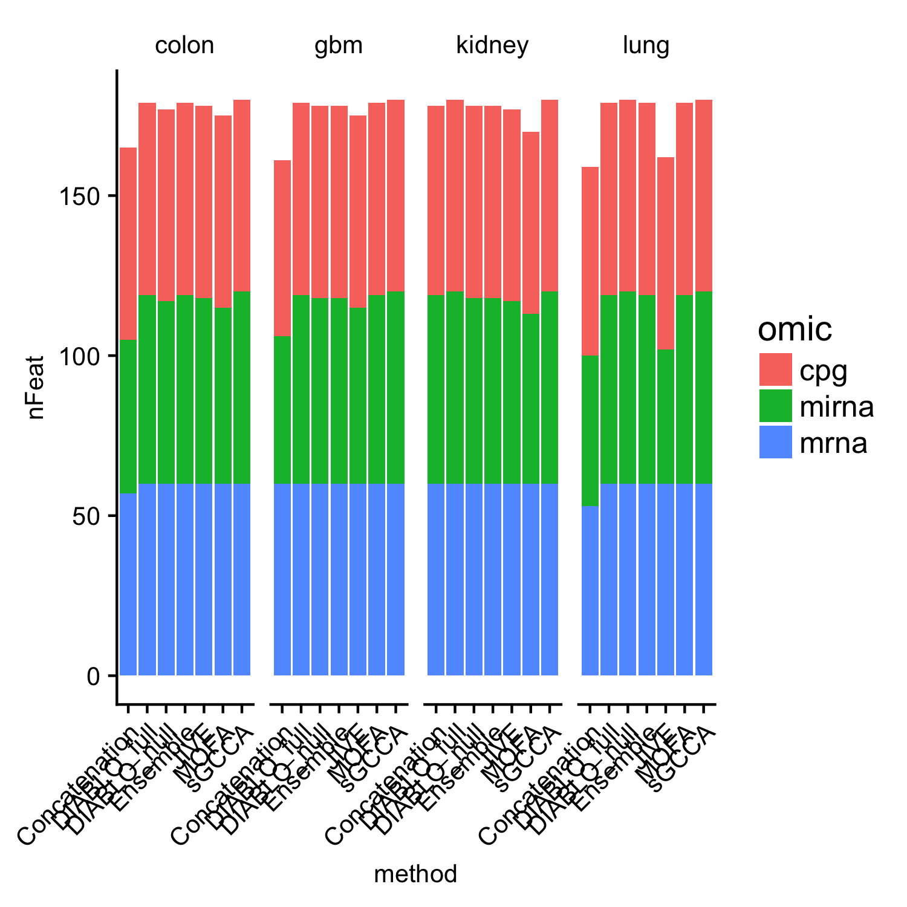

# Component plots

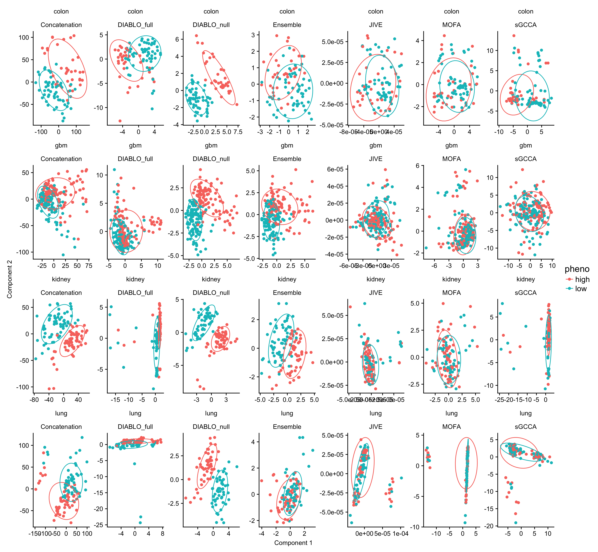

# Overlap in panels

## Colon

### Intersection plot

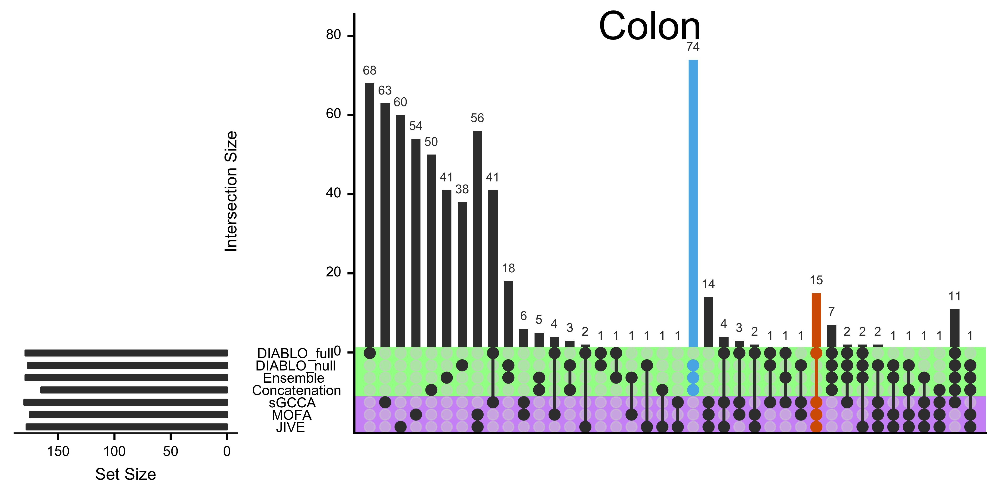

### Venn diagram


## Kidney

### Intersection plot

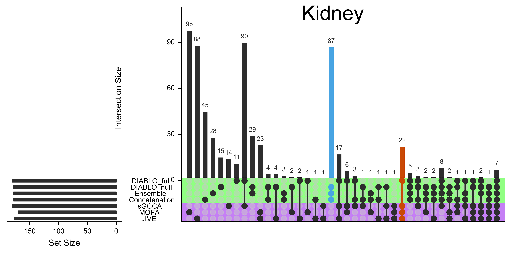

### Venn diagram


## GBM

### Intersection plot


### Venn diagram

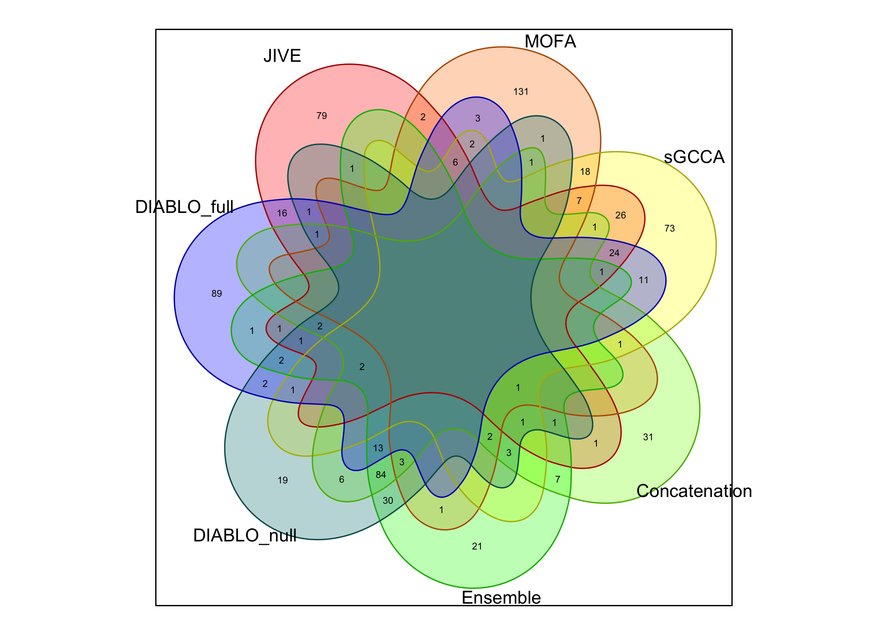

## Lung

### Intersection plot

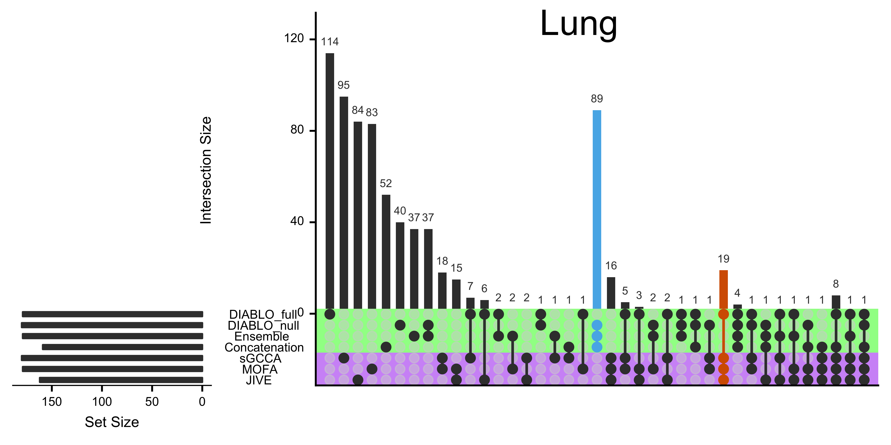

### Venn diagram


# Gene set enrichment analysis
  * We wished to assess the enrichment of the selected features across a variety of annotated gene sets in the MSigDB collection (http://software.broadinstitute.org/gsea/msigdb), in particular:
1. C1 - positional gene sets  for each human chromosome and cytogenetic band.
2. C2 – curated gene sets (Pathway Interaction DB [PID], Biocarta [BIOCARTA], Kyoto Encyclopedia of Genes and Genomes [KEGG], Reactome [REACTOME], and others)
3. C3 - 	motif gene sets  based on conserved cis-regulatory motifs from a comparative analysis of the human, mouse, rat, and dog genomes.
4.	C4 – computational gene sets (from the Cancer Gene Neighbourhoods [CGN] and Cancer Modules [CM] – citation available via: http://www.broadinstitute.org/gsea/msigdb/collections.jsp)
5. C5 - GO gene sets  consist of genes annotated by the same GO terms.
6.	C6 – ontologic gene sets (Gene sets represent signatures of cellular pathways which are often dis-regulated in cancer).
7. C7 - immunologic gene sets  defined directly from microarray gene expression data from immunologic studies.
8. H - hallmark gene sets  are coherently expressed signatures derived by aggregating many MSigDB gene sets to represent well-defined biological states or processes.
&
A. BTM - Blood Transcriptional Modules (https://www.ncbi.nlm.nih.gov/pmc/articles/PMC2727981/)
B. TISSUES - cell-specific expression from Benita et al. Blood 2008 http://www.bloodjournal.org/content/115/26/5376

  *  Significance of enrichment was determined using a hypergeometric test of the overlap between the selected features (mapped to official HUGO gene symbols or official miRNA symbols) and the various gene sets contained in the collections. Resulting p-values were corrected for multiple hypothesis using the Benjamini-Hochberg procedure applied across ALL genesets (10k+ tests – as pessimistic as possible). Adjusted p-values are reported in the fdr column.

## mRNA and CpGs


```
## # A tibble: 28 x 13
##    disease        method         type   BTM    C1    C2    C3    C4    C5
##  *   <chr>         <chr>        <chr> <int> <int> <int> <int> <int> <int>
##  1   colon Concatenation   supervised     0     0    12    11     1     7
##  2   colon   DIABLO_full   supervised    23     0   113     0    46   216
##  3   colon   DIABLO_null   supervised     0     0    21     6     1     0
##  4   colon      Ensemble   supervised     0     0     3     2     2     0
##  5   colon          JIVE unsupervised     0     0    15     8     0    19
##  6   colon          MOFA unsupervised     4     0    14     5     1    36
##  7   colon         sGCCA unsupervised     0     0     5    14     0   147
##  8     gbm Concatenation   supervised    10     0   258    14    47   526
##  9     gbm   DIABLO_full   supervised    30     0   426    34   125   693
## 10     gbm   DIABLO_null   supervised    10     0   312    15    62   776
## # ... with 18 more rows, and 4 more variables: C6 <int>, C7 <int>,
## #   H <int>, TISSUES <int>
```

### which method is leads to the greatest number of signficant pathways?

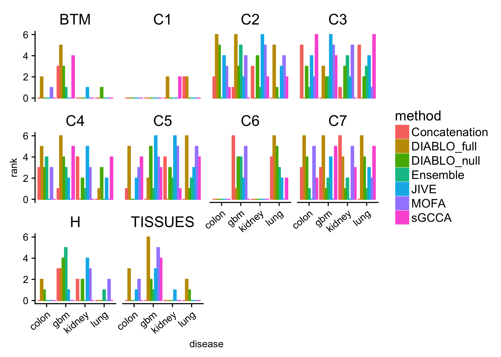

# Connectivity


## datasets of multi-omic panels


```
## [1] "JIVE"          "MOFA"          "sGCCA"         "Concatenation"
## [5] "Ensemble"      "DIABLO_null"   "DIABLO_full"
```

## adjacency matrices


## Number of connections

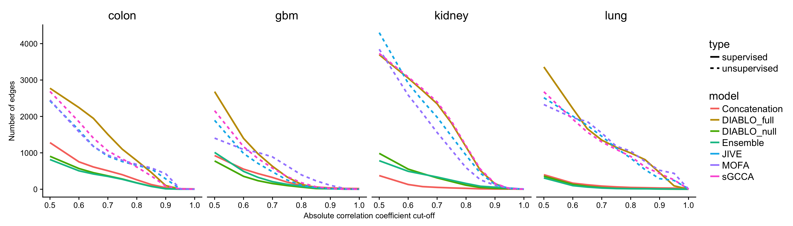

# Network attributes

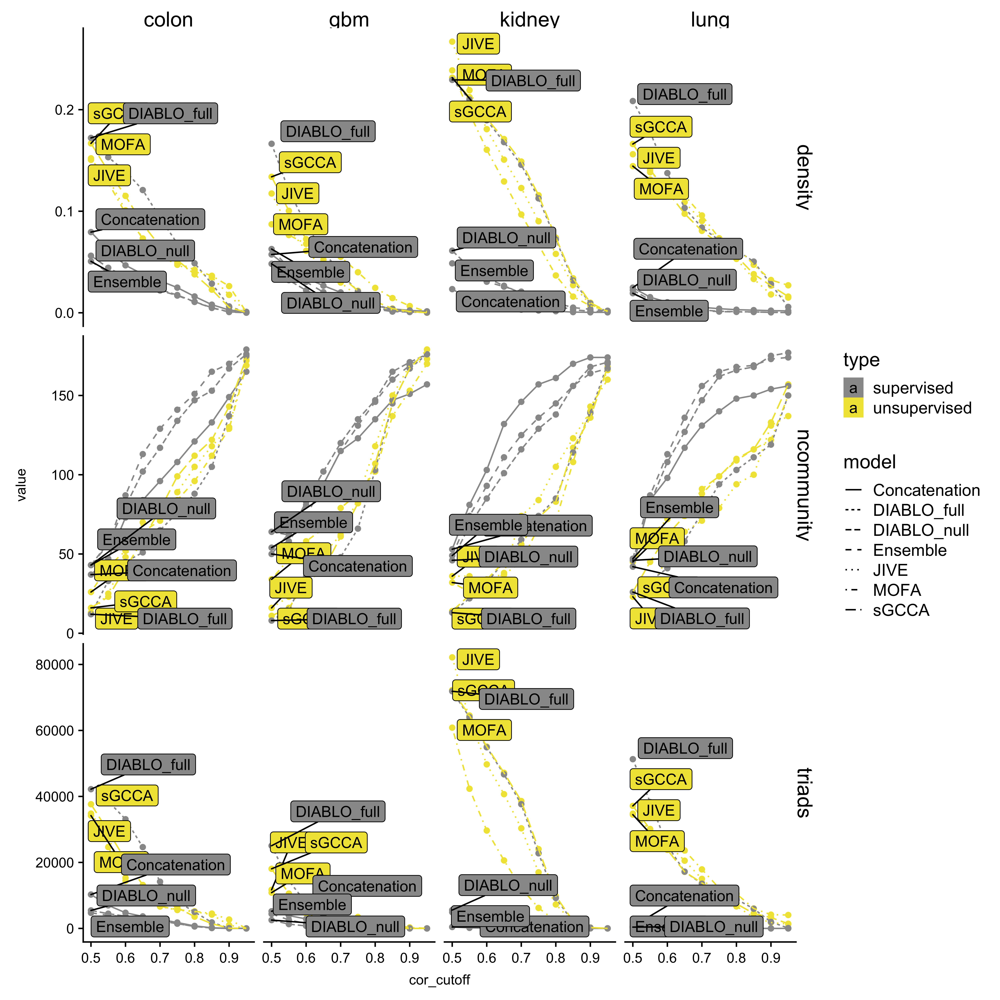

## all network plots

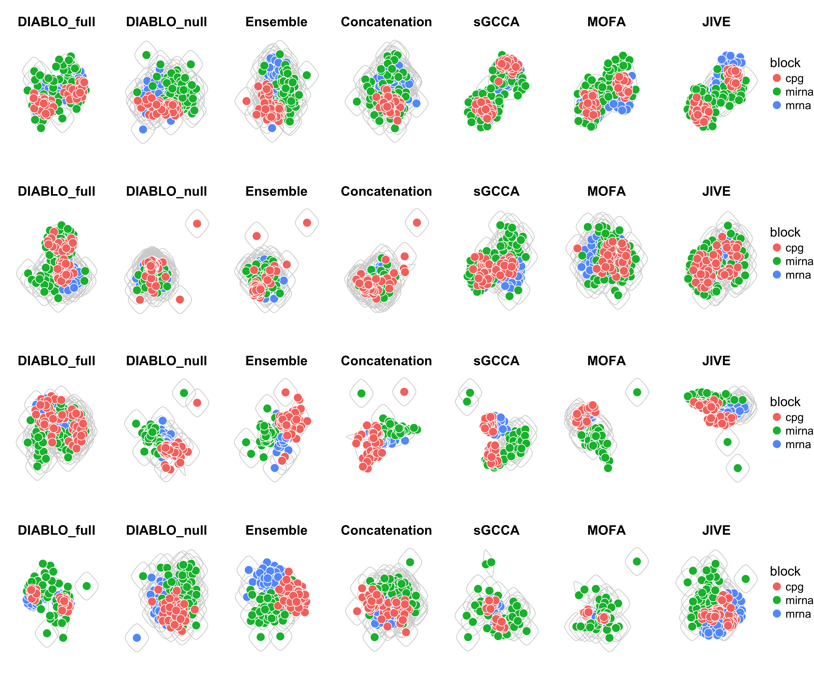

## network and component plot of the multi-omic panels derived using the colon cancer dataset

### networks

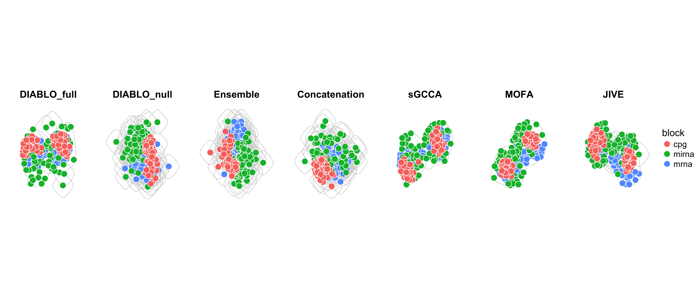

## colon component plot

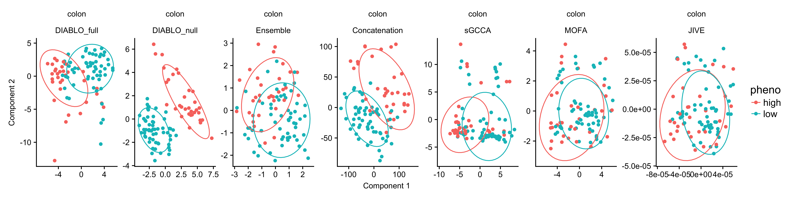

