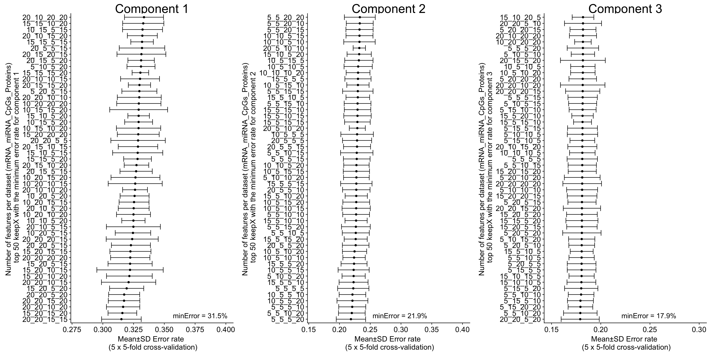
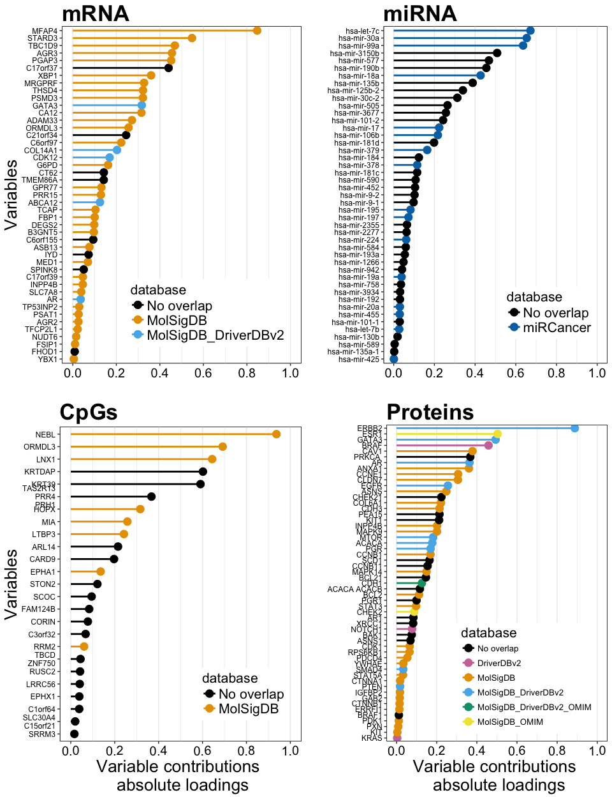

\pagebreak

## Number of samples and variables per dataset


```
##    mRNA miRNA CpGs Proteins          Attribute
## 1   379   379  379      379  Number of Samples
## 2 16851   349 9482      115 Number of features
```

## Phenotype breakdown


```
## Y.train
## Basal  Her2  LumA  LumB 
##    76    38   188    77
```

## Tune DIABLO model

<!-- -->

## Optimal DIABLO model


```
## [1] TRUE
```


```
## # A tibble: 3 x 4
## # Groups:   comp [3]
##         keepX meanError    sdError   comp
##        <fctr>     <dbl>      <dbl> <fctr>
## 1 20_20_15_15 0.3151199 0.01609716  comp1
## 2    5_5_5_20 0.2186374 0.02387432  comp2
## 3  20_20_5_20 0.1791252 0.01936363  comp3
```

### optimal keepX


```
## $mRNA
## [1] 20  5 20
## 
## $miRNA
## [1] 20  5 20
## 
## $CpGs
## [1] 15  5  5
## 
## $Proteins
## [1] 15 20 20
```

## run DIABLO - with optimal keepX


### Number of variables of each omic-type in the diablo panel


```
##     mRNA    miRNA     CpGs Proteins 
##       45       45       25       55
```

### overlap between the different omic compartments (mRNA,miRNA,CpGs and Protein)
  * all mRNA, CpGs and proteins have been converted to gene symbols

<!-- -->

#### overlap between the mRNA and CpGs


```
## [1] "ORMDL3"
```

#### overlap between the mRNA and Proteins


```
## [1] "GATA3"  "INPP4B" "AR"
```

### overlap between the diablo panel features (mRNA,miRNA,CpGs and Protein) and with curated databases

<!-- -->

## Feature Plot

<!-- -->

## Evaluate performance of diablo panel using additional data (test datasets)


```
## [1] TRUE
```

```
## [1] TRUE
```

```
## [1] TRUE
```

```
## [1] TRUE
```

```
## [1]   379 16851
```

```
## [1] 379 349
```

```
## [1]  379 9482
```

```
## [1] 379 115
```

```
## [1] 989
```

```
## [1] TRUE
```

```
## [1] TRUE
```

```
## [1] TRUE
```

```
## [1]   610 16851
```

```
## [1] 610 349
```

```
## [1]  610 9482
```

### Number of samples in the train and test datasets


```
##   Basal Her2 LumA LumB   Set
## 1    76   38  188   77 Train
## 2   102   40  346  122  Test
```


```
##       Basal        Her2        LumA        LumB  Overall.ER Overall.BER 
##  0.04901961  0.20000000  0.13294798  0.53278689  0.20327869  0.22868862
```

# DIABLO (Sample plots)


```
## pdf 
##   3
```

## heatmap


```
## quartz_off_screen 
##                 2
```

# network

<!-- -->

```
##  1  2  3 12 
## 72 15 17 16
```

```
##     mRNA    miRNA     CpGs Proteins 
##       20       21       15       16
```

```
## quartz_off_screen 
##                 2
```

```
## quartz_off_screen 
##                 2
```
