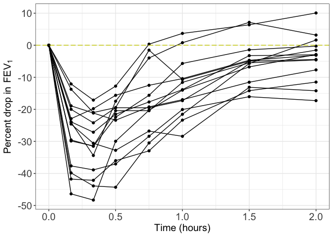
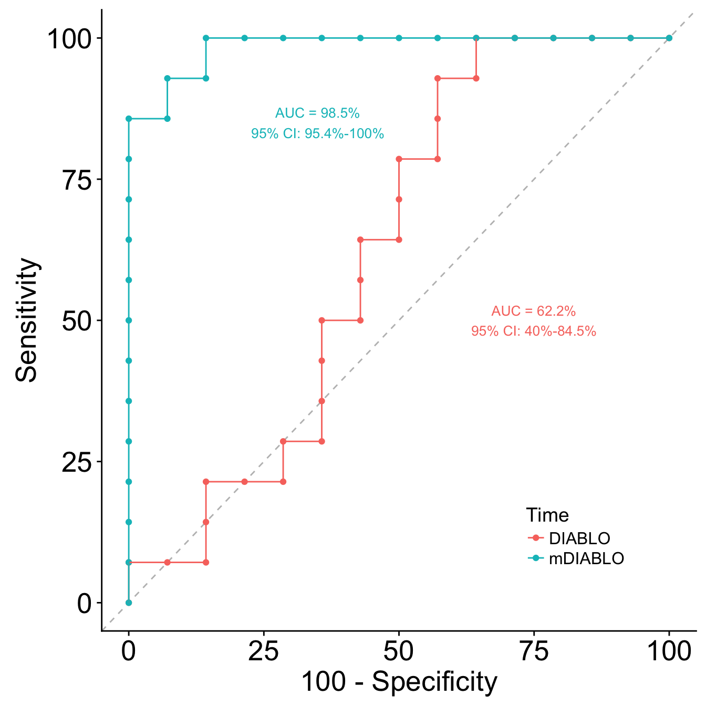
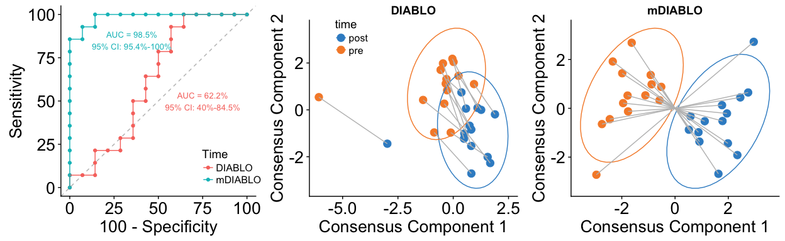
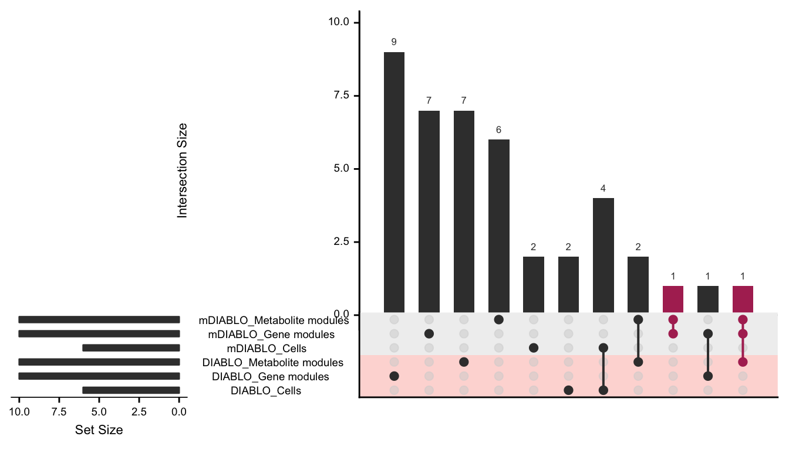
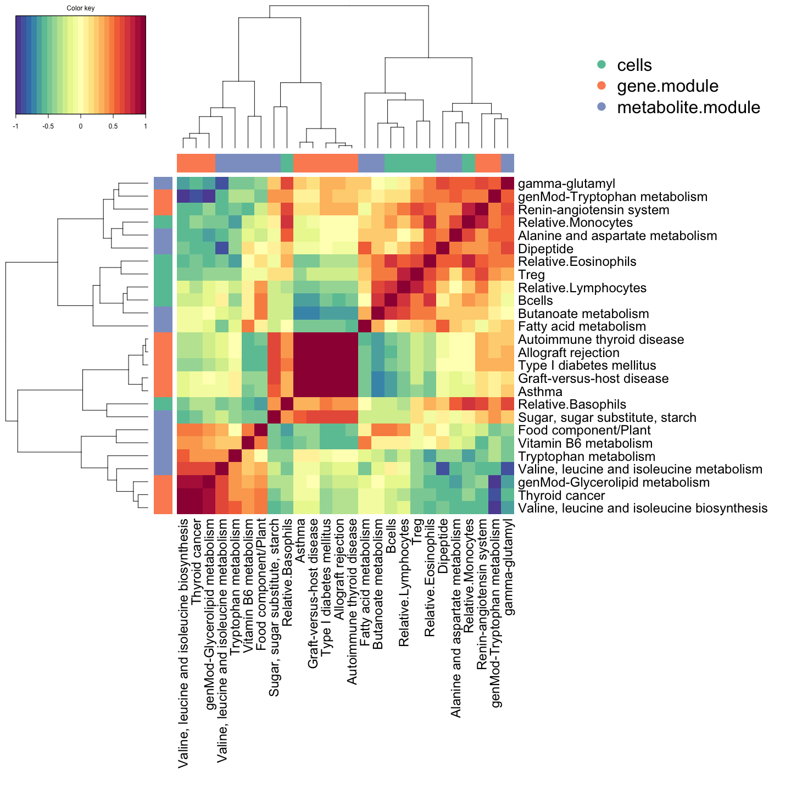
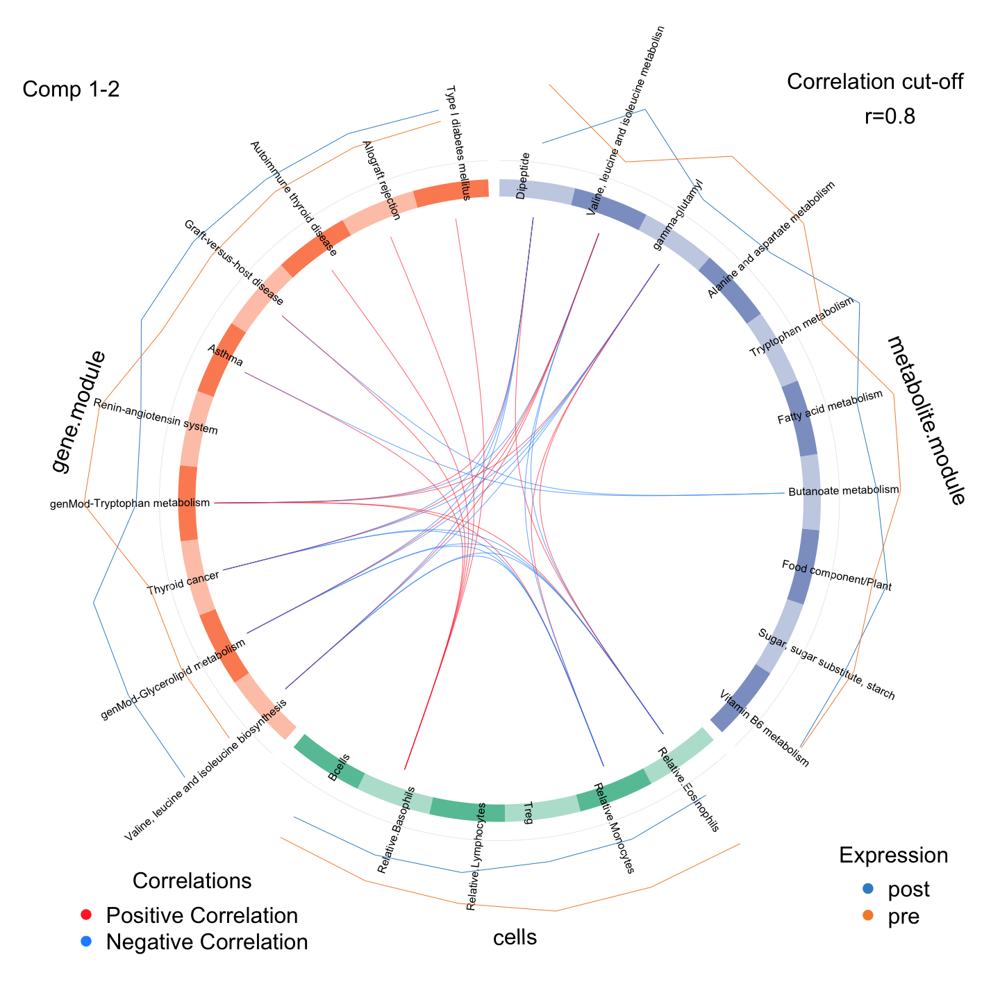
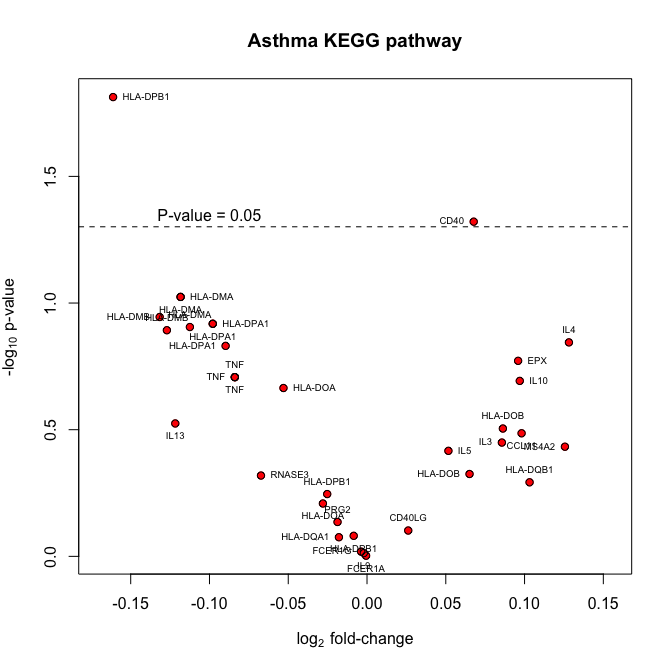

\pagebreak

## FEV1 profiles

<!-- -->

## DIABLO

### tune keepX


```
## $cells
## [1] 28  9
## 
## $gene.module
## [1]  28 229
## 
## $metabolite.module
## [1] 28 60
```

### error rate of optimal keepX

<!-- -->

### diablo - unpaired and paired


### Component plots

<!-- -->

## compare multi-omic panels


```
## [1] "Valine, leucine and isoleucine metabolism"
## [2] "Tryptophan metabolism"
```

<!-- -->

### heatmap

<!-- -->

### circosplot

<!-- -->

### Asthma KEGG pathway


```
## [1] 35 28
```

<!-- -->

