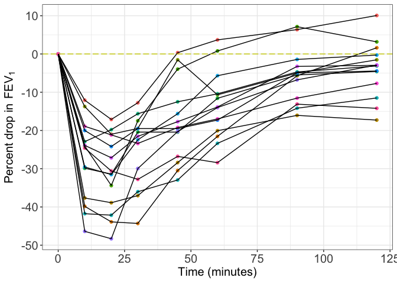
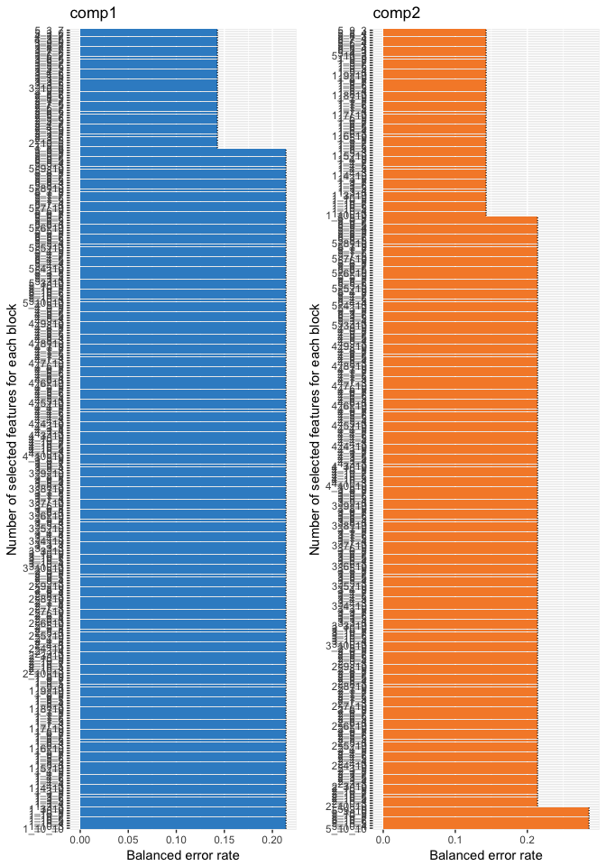
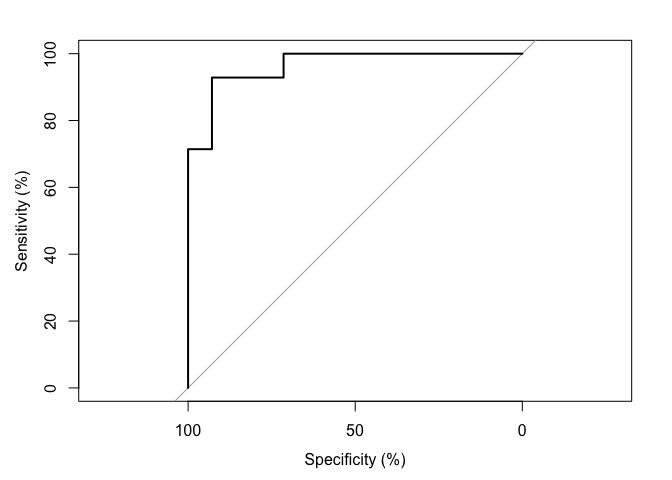
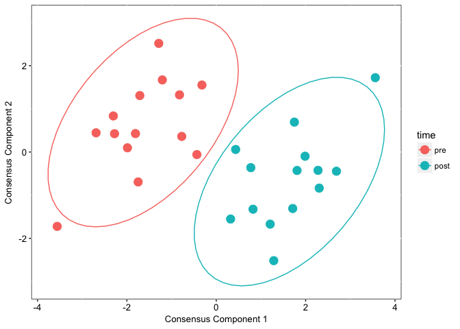
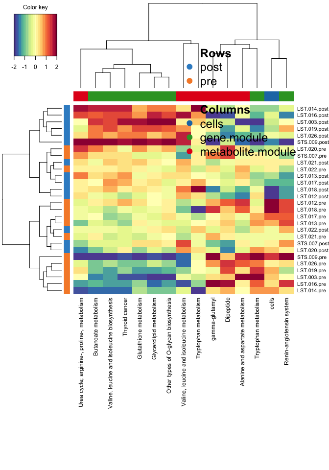
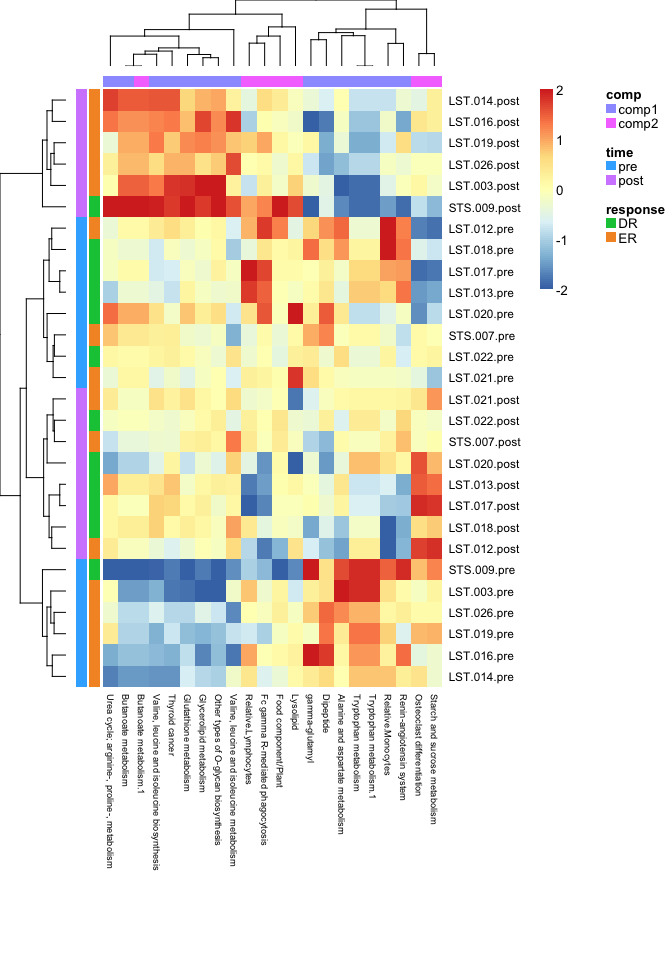

\pagebreak

# FEV1 profiles

<!-- -->

# DIABLO

## tune keepX

<!-- -->

```
## $cells
## [1] 1 1
## 
## $gene.module
## [1] 8 3
## 
## $metabolite.module
## [1] 6 3
```

```
## # A tibble: 2 x 3
## # Groups:   comp [2]
##   keepX  comp     error
##   <chr> <chr>     <dbl>
## 1 2_3_5 comp1 0.1428571
## 2 1_3_3 comp2 0.1428571
```

## error rate of optimal keepX

```
## $max.dist
##                comp 1    comp 2
## post        0.2142857 0.1428571
## pre         0.2142857 0.1428571
## Overall.ER  0.2142857 0.1428571
## Overall.BER 0.2142857 0.1428571
## 
## $centroids.dist
##                comp 1    comp 2
## post        0.1428571 0.1428571
## pre         0.1428571 0.1428571
## Overall.ER  0.1428571 0.1428571
## Overall.BER 0.1428571 0.1428571
## 
## $mahalanobis.dist
##                comp 1    comp 2
## post        0.1428571 0.1428571
## pre         0.1428571 0.1428571
## Overall.ER  0.1428571 0.1428571
## Overall.BER 0.1428571 0.1428571
```

## AUC


```
## [1] TRUE
```

<!-- -->

```
## Area under the curve: 96.43%
```

# Component plots

<!-- -->

# heatmap

<!-- -->

> the above heatmap shows cells as an individula feature name

<!-- -->


# Circos plot

>Error in `row.names<-.data.frame`(`*tmp*`, value = value) : invalid 'row.names' length


## network


