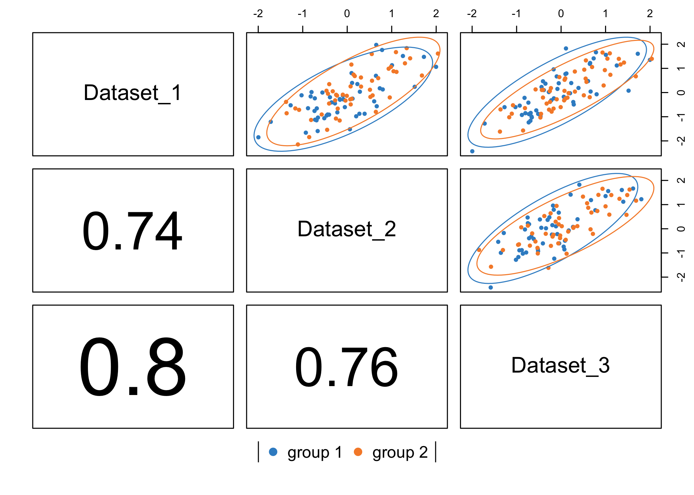
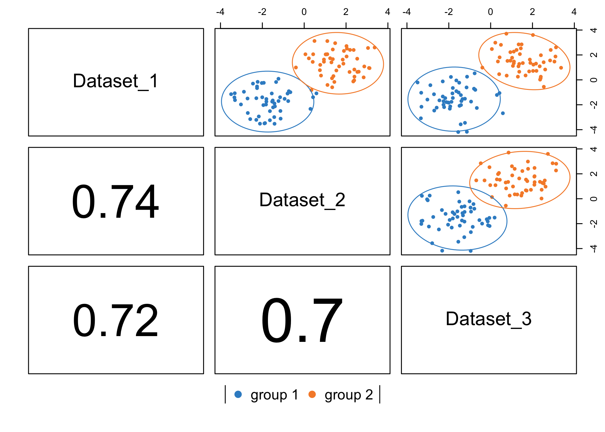
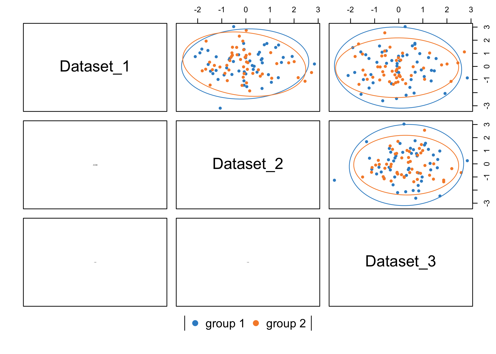
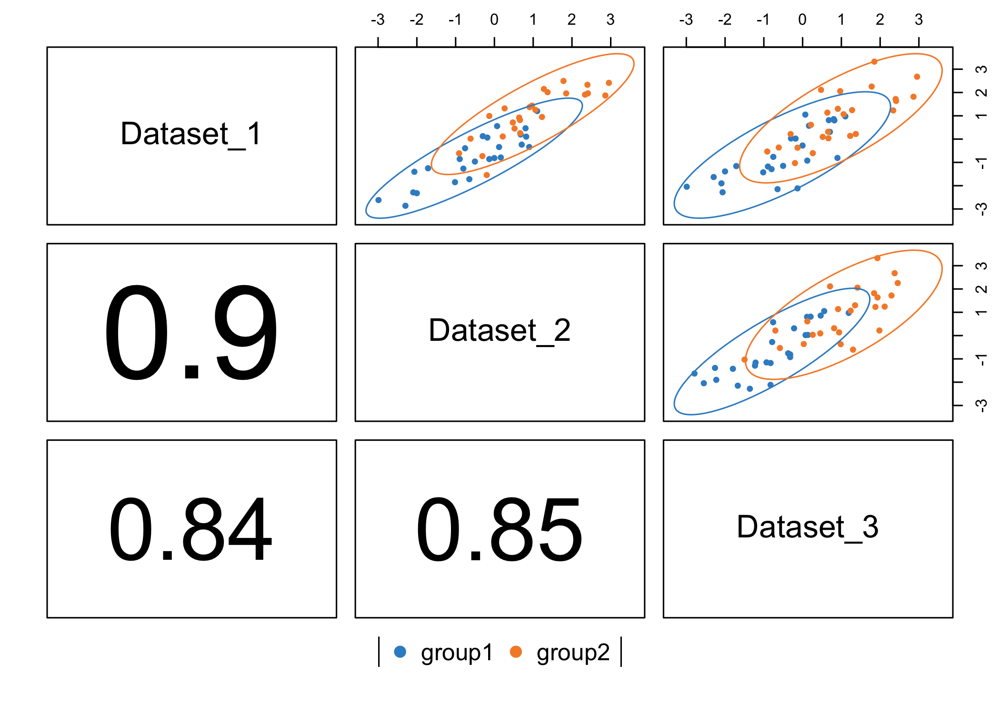
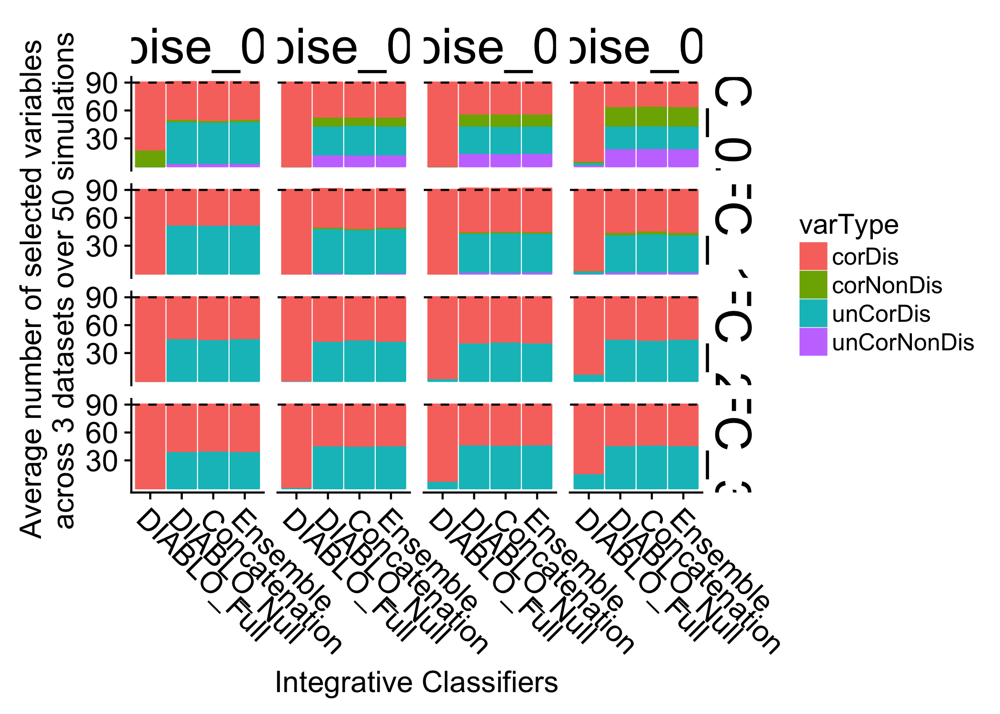

# Simulation study

## Objectives
* how does DIABLO compares with existing integrative classification schemes (Concatenation and Ensemble)
* effect of the design (connection between datasets) on the types of variables selected (correlated vs. discriminatory) and error rate

\pagebreak

## Generate different types of variables and apply diablo to each type separately
* 3 datasets (effective sample size = 100; group1=100 observations, group2=100 observations)
* each dataset has four types of variables; lets explore them now


```r
# simulate data with a Fold-change of 2 and noise of 0.5
fc = 2
noise = 0.5
J = 3
n = 25
p_relevant = 10
p_irrelevant = 50
simdata <- simData(fc, noise, J, n, p_relevant, p_irrelevant)
```

## Correlated & Discriminatory (corDis) components


```r
pairPlot(mat = simdata$bComp.full, group = factor(simdata$Y))
```



## Correlated & Non-Discriminatory (corNonDis) components


```r
pairPlot(mat = simdata$bComp_full_irrelevant, group = factor(simdata$Y))
```



## unCorrelated & Non-Discriminatory (unCorNonDis) components


```r
pairPlot(mat = simdata$bComp.full, group = factor(simdata$Y))
```



## unCorrelated & Non-Discriminatory (unCorNonDis) components


```r
pairPlot(mat = simdata$bComp.full, group = factor(simdata$Y))
```



## Simulation: vary noise and fold-change and compare with other schemes (concatenation/ensembles)
* concatenation_splsda, ensemble_splsda, diabloFull, diabloNull


```r
J <- 3
fcSeq <- c(0.5, 1, 2, 4)
noiseSeq <- c(0.2, 0.3, 0.4, 0.5)
fc.noise.grid <- expand.grid(fcSeq, noiseSeq)
colnames(fc.noise.grid) <- c("FC", "Noise")
varsList <- errList <- list()
nperms <- 5
J = 3
n = 100
p_relevant = 30
p_irrelevant = 100
folds = 10
nrepeat = 1
ncomp = 1
cpus = 1

varsList_repeat <- errList_repeat <- list()
for (z in 1:nperms) {
    for (h in 1:nrow(fc.noise.grid)) {
        fc <- fc.noise.grid[h, "FC"]
        noise <- fc.noise.grid[h, "Noise"]
        
        ## Generate data given fc and noise
        genDats <- simData(fc = fc, noise = noise, J, n, p_relevant, p_irrelevant)
        data <- genDats$data
        Y <- genDats$Y
        
        ## Apply DIABLO full design
        design <- matrix(1, nrow = J, ncol = J)
        diag(design) <- 0
        keepX = list(rep(p_relevant, 1), rep(p_relevant, 1), rep(p_relevant, 
            1))
        rownames(design) <- colnames(design) <- names(keepX) <- names(data)
        result.full = block.splsda(X = data, Y = Y, ncomp = 1, keepX = keepX, 
            design = design)
        diabloFullPanels <- selectVar(result.full)[1:J] %>% lapply(., function(i) {
            i[[1]]
        }) %>% unlist(.)
        cv.full <- perf(result.full, validation = "Mfold", folds = folds, nrepeat = nrepeat, 
            progressBar = FALSE)
        
        ## Apply DIABLO null design
        design <- matrix(0, nrow = J, ncol = J)
        rownames(design) <- colnames(design) <- names(data)
        result.null = block.splsda(X = data, Y = Y, ncomp = 1, keepX = keepX, 
            design = design)
        diabloNullPanels <- selectVar(result.null)[1:J] %>% lapply(., function(i) {
            i[[1]]
        }) %>% unlist(.)
        cv.null <- perf(result.null, validation = "Mfold", folds = folds, nrepeat = nrepeat, 
            cpus = cpus, progressBar = FALSE)
        
        ## Concatenation
        concat <- splsda(X = do.call(cbind, data), Y = Y, keepX = rep(J * p_relevant, 
            1), ncomp = 1)
        concatPanels <- selectVar(concat)$name
        cv.concat <- perf(concat, validation = "Mfold", folds = folds, nrepeat = nrepeat, 
            progressBar = FALSE)
        
        ## Ensemble
        ensemblePanels <- lapply(data, function(i) {
            result <- splsda(X = i, Y = Y, keepX = rep(p_relevant, 1), ncomp = ncomp)
            selectVar(result)$name
        }) %>% unlist()
        cv.ensemble <- perf.ensemble.splsda(data, Y, keepX = rep(p_relevant, 
            1), ncomp = ncomp, nrepeat = nrepeat, M = folds)
        
        ## Proportion of selected variables
        panels <- list(DIABLO_Full = diabloFullPanels, DIABLO_Null = diabloNullPanels, 
            Concatenation = concatPanels, Ensemble = ensemblePanels)
        
        vars <- lapply(panels, function(i) {
            as.character(sapply(strsplit(i, "\\."), function(i) i[1]))
        })
        dats <- lapply(panels, function(i) {
            as.character(sapply(strsplit(diabloFullPanels, "_"), function(i) paste(i[-1], 
                collapse = "_")))
        })
        varDat <- cbind(unlist(dats), unlist(vars)) %>% as.data.frame() %>% 
            mutate(dataset = V1, varType = V2, Classifier = rep(names(dats), 
                sapply(dats, length))) %>% dplyr::select(dataset:Classifier)
        varDat$FC <- paste("FC", fc, sep = "_")
        varDat$Noise <- paste("Noise", noise, sep = "_")
        varsList[[h]] <- varDat %>% group_by(varType, Classifier, FC, Noise) %>% 
            summarise(n = n()) %>% complete(varType, nesting(FC, Noise, Classifier), 
            fill = list(n = 0))
        
        ## Error rates
        err <- data.frame(error = c(cv.full$WeightedVote.error.rate$max.dist["Overall.BER", 
            ], cv.null$WeightedVote.error.rate$max.dist["Overall.BER", ], cv.concat$error.rate$BER[, 
            "max.dist"], cv.ensemble$Mean)) %>% mutate(Classifier = c("DIABLO_Full", 
            "DIABLO_Null", "Concatenation", "Ensemble"))
        err$FC <- paste("FC", fc, sep = "_")
        err$Noise <- paste("Noise", noise, sep = "_")
        errList[[h]] <- err
    }
    varsList_repeat[[z]] <- do.call(rbind, varsList)
    errList_repeat[[z]] <- do.call(rbind, errList)
}
```

### Selected variables


```r
selectedVars <- do.call(rbind, varsList_repeat) %>% ungroup %>% mutate(Classifier = factor(Classifier, 
    levels = c("DIABLO_Full", "DIABLO_Null", "Concatenation", "Ensemble"))) %>% 
    group_by(Classifier, FC, Noise, varType) %>% summarise(Mean = mean(n), SD = sd(n)) %>% 
    ggplot(aes(x = Classifier, y = Mean, color = varType, fill = varType)) + 
    geom_bar(stat = "identity", position = "dodge") + geom_errorbar(aes(ymin = Mean, 
    ymax = Mean + SD), position = "dodge") + facet_grid(FC ~ Noise) + customTheme(sizeStripFont = 15, 
    xAngle = -45, hjust = 0, vjust = 1, xSize = 10, ySize = 10, xAxisSize = 10, 
    yAxisSize = 10) + ylab("Mean±SD of the number of selected variables (50 simulations)") + 
    geom_hline(yintercept = 90, linetype = "dashed") + xlab("Integrative Classifiers")
selectedVars
```



```r
pdf(paste0(WhereAmI, "results/selectedVariables.pdf"), width = 10, height = 10)
selectedVars
dev.off()
```

```
## quartz_off_screen 
##                 2
```

## error rate


```r
errorRates <- do.call(rbind, errList_repeat) %>% mutate(Classifier = factor(Classifier, 
    levels = c("DIABLO_Full", "DIABLO_Null", "Concatenation", "Ensemble"))) %>% 
    group_by(Classifier, FC, Noise) %>% summarise(Mean = mean(error), SD = sd(error)) %>% 
    ggplot(aes(x = Classifier, y = Mean)) + geom_bar(stat = "identity") + geom_errorbar(aes(ymin = Mean - 
    SD, ymax = Mean + SD)) + facet_grid(FC ~ Noise) + customTheme(sizeStripFont = 15, 
    xAngle = -45, hjust = 0, vjust = 1, xSize = 10, ySize = 10, xAxisSize = 10, 
    yAxisSize = 10) + ylab("Mean±SD of error rate (10-fold cross-validation over 50 simulations)") + 
    xlab("Integrative Classifiers") + geom_hline(yintercept = 0.5, linetype = "dashed")

pdf(paste0(WhereAmI, "results/errorRates.pdf"), width = 10, height = 10)
errorRates
dev.off()
```

```
## quartz_off_screen 
##                 2
```

